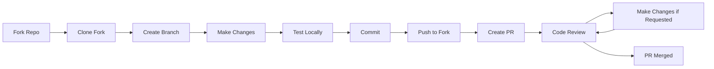

# Contributing to Weather Dashboard

First off, thank you for considering contributing to Weather Dashboard! 🎉

It's people like you that make Weather Dashboard such a great tool. We welcome contributions from everyone, whether you're fixing a bug, improving documentation, or proposing new features.

## 📋 Table of Contents

- [Code of Conduct](#code-of-conduct)
- [Getting Started](#getting-started)
- [How Can I Contribute?](#how-can-i-contribute)
- [Development Setup](#development-setup)
- [Pull Request Process](#pull-request-process)
- [Coding Standards](#coding-standards)
- [Commit Message Guidelines](#commit-message-guidelines)
- [Testing](#testing)
- [Documentation](#documentation)

## 📜 Code of Conduct

This project and everyone participating in it is governed by our [Code of Conduct](CODE_OF_CONDUCT.md). By participating, you are expected to uphold this code. Please report unacceptable behavior to mkhabelafefe@gmail.com.

## 🚀 Getting Started

### Prerequisites

- Git installed on your machine
- A text editor or IDE (VS Code, Sublime, etc.)
- Basic knowledge of HTML, CSS, and JavaScript
- A GitHub account
- OpenWeatherMap API key (free tier)

### Types of Contributions We're Looking For

- 🐛 Bug reports and fixes
- ✨ New features and enhancements
- 📝 Documentation improvements
- 🎨 UI/UX improvements
- ♿ Accessibility improvements
- 🌍 Internationalization/Localization
- ⚡ Performance optimizations
- 🧪 Test coverage improvements

## 🤝 How Can I Contribute?

### Reporting Bugs

Before creating bug reports, please check existing issues to avoid duplicates.

**When reporting a bug, include:**

- A clear and descriptive title
- Steps to reproduce the behavior
- Expected behavior vs. actual behavior
- Screenshots (if applicable)
- Browser and version information
- API key status (without exposing the key)
- Console error messages

**Bug Report Template:**

```markdown
## Bug Description
A clear description of what the bug is.

## Steps to Reproduce
1. Go to '...'
2. Click on '...'
3. Scroll down to '...'
4. See error

## Expected Behavior
What you expected to happen.

## Actual Behavior
What actually happened.

## Screenshots
If applicable, add screenshots.

## Environment
- Browser: [e.g., Chrome 120]
- OS: [e.g., Windows 11]
- Device: [e.g., Desktop, iPhone 12]

## Additional Context
Any other context about the problem.
```

### Suggesting Enhancements

Enhancement suggestions are tracked as GitHub issues. When creating an enhancement suggestion, include:

- A clear and descriptive title
- A detailed description of the proposed enhancement
- Explain why this enhancement would be useful
- List any alternative solutions you've considered
- Include mockups or examples (if applicable)

**Enhancement Template:**

```markdown
## Feature Description
A clear description of the feature.

## Problem It Solves
Explain the problem this feature would solve.

## Proposed Solution
Describe how you envision this feature working.

## Alternatives Considered
List any alternative solutions.

## Additional Context
Mockups, examples, or references.
```

### Your First Code Contribution

Unsure where to begin? Look for issues labeled:

- `good first issue` - Good for newcomers
- `help wanted` - Extra attention needed
- `bug` - Something isn't working
- `enhancement` - New feature or request
- `documentation` - Improvements or additions to documentation

## 💻 Development Setup

### 1. Fork the Repository

Click the "Fork" button at the top right of the repository page.

### 2. Clone Your Fork

```bash
git clone https://github.com/your-username/weather-dashboard.git
cd weather-dashboard
```

### 3. Add Upstream Remote

```bash
git remote add upstream https://github.com/original-owner/weather-dashboard.git
```

### 4. Create a Branch

```bash
git checkout -b feature/your-feature-name
# or
git checkout -b fix/your-bug-fix
```

### 5. Set Up API Key

1. Get your API key from [OpenWeatherMap](https://openweathermap.org/api)
2. Open `script.js`
3. Replace `YOUR_API_KEY_HERE` with your actual key
4. **Never commit your API key**

### 6. Make Your Changes

- Write clean, readable code
- Follow the existing code style
- Comment your code where necessary
- Test your changes thoroughly

### 7. Test Your Changes

Open `index.html` in multiple browsers:
- Chrome
- Firefox
- Safari
- Edge

Test on different devices:
- Desktop
- Tablet
- Mobile

## 🔄 Pull Request Process

### Before Submitting

- [ ] Code follows the project's coding standards
- [ ] Self-review completed
- [ ] Comments added for complex logic
- [ ] Documentation updated (if needed)
- [ ] No console errors
- [ ] Tested on multiple browsers
- [ ] Tested on mobile devices
- [ ] No merge conflicts with main branch

### Submitting a Pull Request

1. **Update Your Branch**
   ```bash
   git fetch upstream
   git merge upstream/main
   ```

2. **Commit Your Changes**
   ```bash
   git add .
   git commit -m "Add: brief description of changes"
   ```

3. **Push to Your Fork**
   ```bash
   git push origin feature/your-feature-name
   ```

4. **Create Pull Request**
   - Go to your fork on GitHub
   - Click "New Pull Request"
   - Select your branch
   - Fill out the PR template

### Pull Request Template

```markdown
## Description
Brief description of changes made.

## Type of Change
- [ ] Bug fix
- [ ] New feature
- [ ] Documentation update
- [ ] Code refactoring
- [ ] Performance improvement

## How Has This Been Tested?
Describe the tests you ran.

## Screenshots (if applicable)
Add screenshots to demonstrate changes.

## Checklist
- [ ] My code follows the style guidelines
- [ ] I have performed a self-review
- [ ] I have commented my code
- [ ] I have updated the documentation
- [ ] My changes generate no new warnings
- [ ] I have tested on multiple browsers

## Related Issues
Closes #(issue number)
```

### After Submitting

- Respond to any feedback or questions
- Make requested changes promptly
- Keep the PR updated with main branch
- Be patient - reviews take time!

## 📏 Coding Standards

### JavaScript

```javascript
// Use const for constants
const API_KEY = 'your-api-key';

// Use let for variables that change
let currentUnit = 'metric';

// Use descriptive variable names
const weatherData = await fetchWeather();

// Use camelCase for variables and functions
function fetchWeatherByCity(cityName) {
    // ...
}

// Add comments for complex logic
// Calculate wind speed in km/h (API returns m/s)
const windSpeedKmh = windSpeedMs * 3.6;

// Use async/await for promises
async function getData() {
    try {
        const response = await fetch(url);
        const data = await response.json();
        return data;
    } catch (error) {
        console.error('Error:', error);
    }
}

// Keep functions small and focused
function formatDate(timestamp) {
    // Single responsibility
}
```

### CSS

```css
/* Use meaningful class names */
.weather-card { }

/* Group related properties */
.container {
    /* Layout */
    display: flex;
    flex-direction: column;
    
    /* Size */
    max-width: 1200px;
    padding: 20px;
    
    /* Visual */
    background: white;
    border-radius: 12px;
}

/* Use consistent spacing */
.header {
    margin-bottom: 30px;
}

/* Comment complex selectors */
/* Hover effect for forecast cards */
.forecast-card:hover {
    transform: translateY(-5px);
}
```

### HTML

```html
<!-- Use semantic HTML -->
<header class="header">
    <h1>Weather Dashboard</h1>
</header>

<!-- Include accessibility attributes -->
<button aria-label="Search weather" id="searchBtn">
    Search
</button>

<!-- Use descriptive IDs and classes -->
<div class="weather-card" id="weatherCard">
    <!-- ... -->
</div>
```

## 📝 Commit Message Guidelines

### Format

```
<type>: <subject>

<body>

<footer>
```

### Types

- **Add**: New feature or functionality
- **Fix**: Bug fix
- **Update**: Update existing feature
- **Remove**: Remove feature or code
- **Refactor**: Code restructuring
- **Style**: Formatting, missing semicolons, etc.
- **Docs**: Documentation changes
- **Test**: Adding or updating tests
- **Chore**: Maintenance tasks

### Examples

```bash
Add: hourly forecast feature

Implemented hourly weather forecast display showing next 24 hours
with temperature and weather icons. Data fetched from OpenWeatherMap
forecast API.

Closes #42
```

```bash
Fix: geolocation error handling

Fixed issue where geolocation errors were not properly displayed
to users. Added specific error messages for different error types.

Fixes #38
```

## 🧪 Testing

### Manual Testing Checklist

- [ ] Search by city name works
- [ ] Geolocation button works
- [ ] Temperature unit toggle works
- [ ] 5-day forecast displays correctly
- [ ] Hourly forecast displays correctly
- [ ] Error messages display properly
- [ ] Loading spinner shows during API calls
- [ ] Last searched city is saved
- [ ] Background changes with weather
- [ ] Responsive on mobile devices
- [ ] Responsive on tablets
- [ ] Works on Chrome
- [ ] Works on Firefox
- [ ] Works on Safari
- [ ] Works on Edge

### Cross-Browser Testing

Test on:
- Chrome (latest 2 versions)
- Firefox (latest 2 versions)
- Safari (latest 2 versions)
- Edge (latest 2 versions)

### Device Testing

Test on:
- Desktop (1920x1080, 1366x768)
- Tablet (768x1024)
- Mobile (375x667, 414x896)

## 📚 Documentation

### Code Comments

- Explain **why**, not **what**
- Document complex algorithms
- Add JSDoc for functions

```javascript
/**
 * Fetches weather data for a given city
 * @param {string} city - The city name to search
 * @returns {Promise<Object>} Weather data object
 */
async function fetchWeatherByCity(city) {
    // Implementation
}
```

### README Updates

If your changes affect:
- Installation steps
- Usage instructions
- Features list
- API requirements

Please update the README.md accordingly.

## 🎯 Development Workflow



## ❓ Questions?

- Open an issue with the `question` label
- Email: mkhabelafefe@gmail.com
- Join our community discussions

## 🙏 Recognition

Contributors will be recognized in:
- README.md contributors section
- Release notes
- GitHub contributors page

Thank you for contributing to Weather Dashboard! 🌤️

---

**Happy Coding!** 💻✨